# 💻 VS Code Setup for Python

*Adapted from Dezerae Cox's [Learning to Code](https://dezeraecox.com/learning-to-code-spaghetti/) resources.*

> **🎯 Goal**
>
> This guide provides general-purpose instructions for setting up a Python coding environment in **Visual Studio Code (VS Code)**.
>
> 💡 **Note:** You do not need extensive prior experience with Python environments or Git. The goal is to introduce these tools early so that environment management and version control become a natural part of your coding workflow.

---

## 📋 Contents

1. [Downloads](#downloads)
2. [Installation](#installation)
3. [Setup](#setup)
   - [VS Code](#vs-code)
   - [General Settings](#general-settings)
   - [Repositories](#repositories)
   - [Python Extension](#python-extension)
   - [Conda Environments](#conda-environments)
4. [Time to Test!](#time-to-test)
5. [Additional Resources](#additional-resources)

---

# 📥 Downloads

Before getting started, download the appropriate version of each program for your operating system:

- [**Miniconda**](https://www.anaconda.com/docs/getting-started/installation) — Python and Conda environment management
- [**Visual Studio Code**](https://code.visualstudio.com/download) — your code editor
- [**GitHub Desktop**](https://desktop.github.com/) — optional graphical interface for Git and GitHub
- [**Git**](https://git-scm.com/downloads) — version control

While the installers are downloading, make sure you have created a [**GitHub account**](https://github.com/).

> 💡 **Tip:** If you have an institutional email address, consider using it when creating your GitHub account. Many institutions provide access to GitHub's educational or organizational benefits.
>
> If you expect to change institutions soon, you may prefer to use a personal email address as your primary account email.

---

# ⚙️ Installation

## 1. Install Visual Studio Code

Install VS Code using the downloaded installer.

**Windows users:** During installation, you may be given options to add VS Code to the context menu or allow it to open files from the Desktop. **Enable these options.**

---

## 2. Install Git

Install Git using the default options wherever possible, with one exception.

For example:

- Let Git decide the default branch name
- Use Git from the command line and third-party software
- Use the bundled OpenSSH
- Use the default credential helper
- Continue with the other recommended defaults

### ⚠️ One setting to change

When prompted to select the default editor, choose:

> **Visual Studio Code**

This allows Git to open VS Code whenever it needs you to edit a commit message or other Git-related text.

---

## 3. Install GitHub Desktop

Install [GitHub Desktop](https://desktop.github.com/) and log in using the GitHub account you created above.

> 💡 **Note:** GitHub Desktop is optional. Git can be used entirely from the command line, but GitHub Desktop provides a convenient graphical interface for common Git operations.

---

## 4. Install Miniconda

Install [Miniconda](https://docs.conda.io/en/latest/miniconda.html) using the default options.

If the installer asks whether to add Conda to your `PATH`, the recommended approach is generally to **leave the default option unchanged** and use the Anaconda/Miniconda Prompt to access Conda.

### 🪟 Windows: Making Conda available from the command line
#### Open Anaconda Prompt
Open **Anaconda Prompt** from the Start menu.

If `(base)` is not written at the start of the line, run `conda activate base`

If Windows does not recognize the `conda` command, you may need to add your Miniconda installation to your system `PATH`.

A common error looks like:

> `'conda' is not recognized as an internal or external command`

See the [Conda documentation](https://docs.conda.io/projects/conda/en/latest/) or [this troubleshooting guide](https://stackoverflow.com/questions/44515769/conda-is-not-recognized-as-internal-or-external-command), also outlined below, if you encounter this problem.

#### Troubleshooting 

1. Find conda location

   Check where conda is installed:

    ```bash
    where conda
    ```
    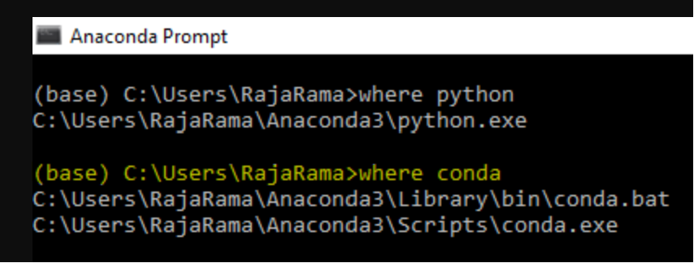

3. Open Advanced System Settings

    Search Windows for Advanced System Settings and open it.

    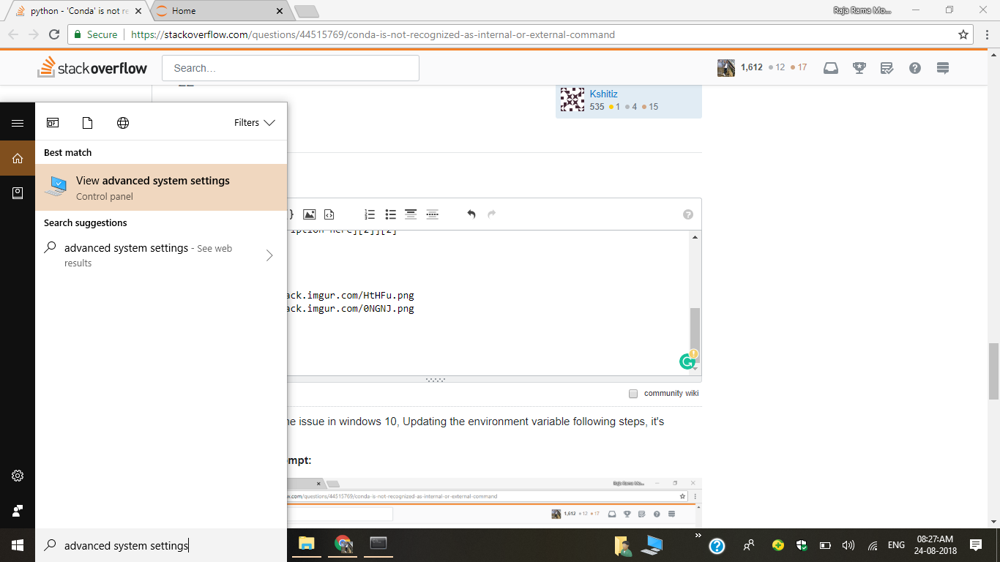

4. Edit Environment Variables

    Click Environment Variables.
    
    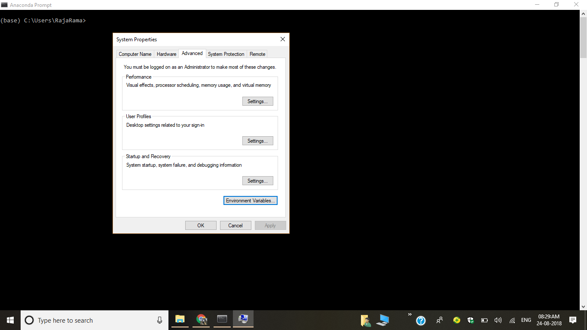

    Under the appropriate user or system variables, select `Path` and click **Edit**.
    
    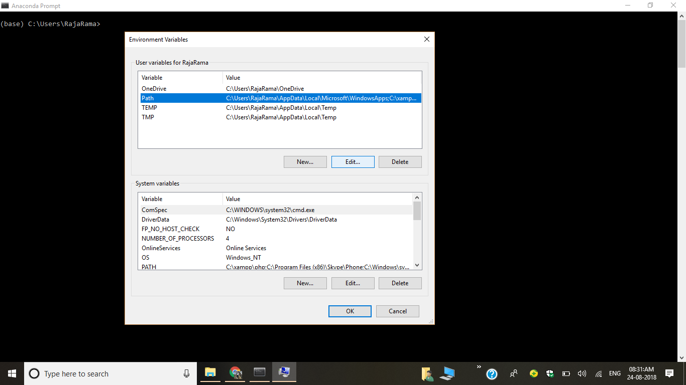    

    Add the Miniconda directories.
    
    add **miniconda3**, **miniconda3\Scripts**, and **miniconda3\Library\bin** paths. If your file structure is similar to mine (look at output from step 2 to determine `conda` path) then the paths should like like the paths below (replace `uXXXXXX` with your username and adjust the path if Miniconda was installed elsewhere)

        C:\Users\uXXXXXX\AppData\Local\miniconda3
        C:\Users\uXXXXXX\AppData\Local\miniconda3\Scripts
        C:\Users\uXXXXXX\AppData\Local\miniconda3\Library\bin

6. Test Conda

    Open Command Prompt -- **not** Anaconda Prompt -- and test the installation:

        conda activate base
    
    If Conda activates successfully, you should see `(base)` at the beginning of the command prompt

    If not, type `conda install anaconda-navigator` then press `y`
    
    Then run `conda activate base` as per [this_help_link](https://conda.io/projects/conda/en/latest/user-guide/tasks/manage-environments.html#activating-an-environment) in case you get a warning.

8.  Restart computer 😊

# 🛠️ Setup

This guide focuses on getting VS Code configured to run Python code. 

For more detailed information about Git-based version control, check out the [Additional Resources](#additional-resources) section below.

## VS Code

1. Launch VS Code, at which point you will be greeted with the “Welcome” screen. Take a few minutes to get familiar with the editor using the “Get Started with VS Code” and “Learn the Fundamentals” sections.
    
    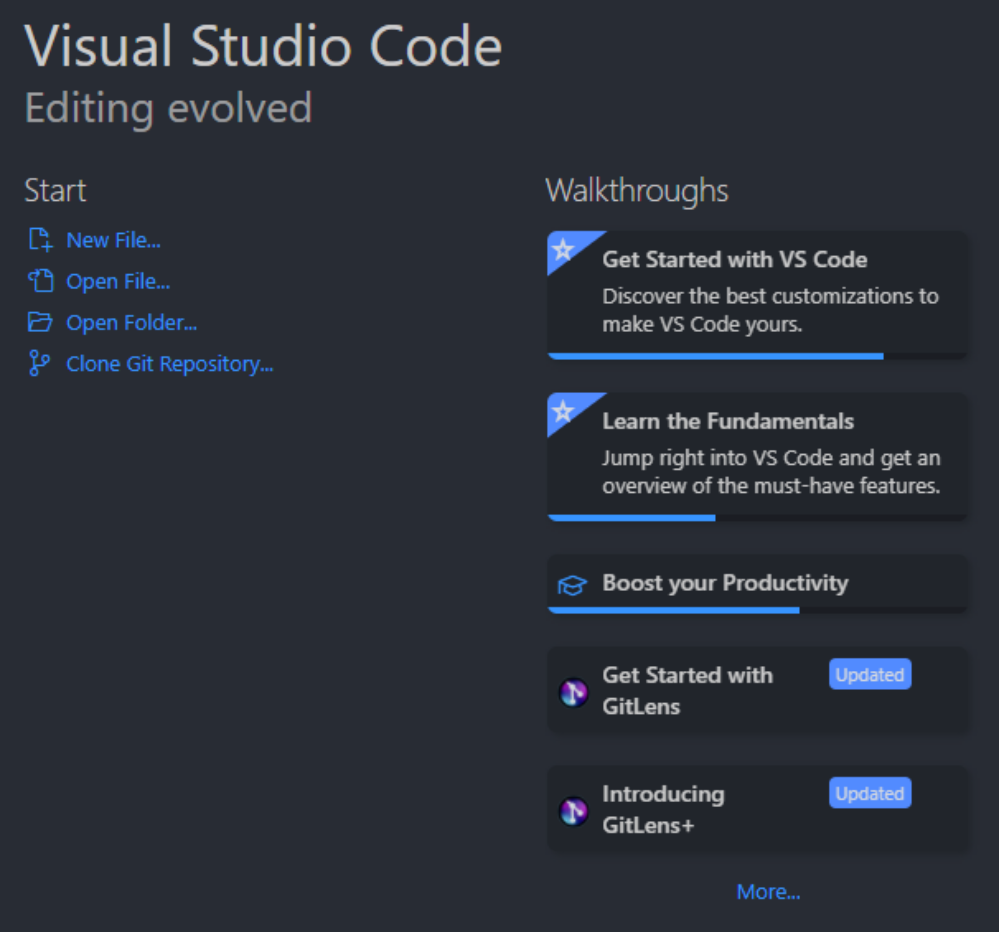    
    
2. Install extensions

    Open the Extensions panel and search for the Python extension.
 
    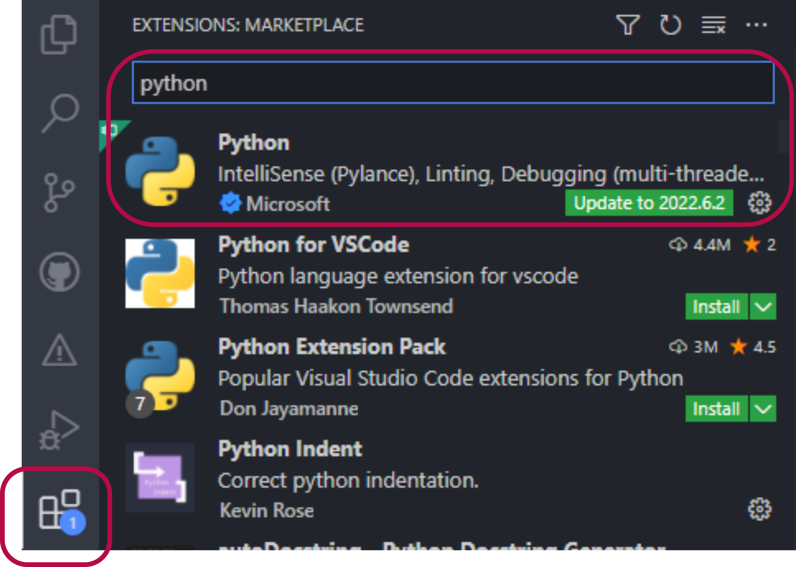    
    
    You may also want to install other useful extensions. Here are a few to get you started:

    | Extension                   | What it does                                               |
    | --------------------------- | ---------------------------------------------------------- |
    | **Atom One Dark Theme**     | A dark theme with clear syntax highlighting                |
    | **Material Icon Theme**     | Adds useful file and folder icons                          |
    | **Jupyter**                 | Provides Jupyter notebook and interactive Python support   |
    | **Sourcery**                | Provides AI-assisted Python refactoring                    |
    | **Atom Keymap**             | Provides a familiar set of popular keyboard shortcuts      |
    | **GitLens**                 | Adds enhanced Git and repository functionality             |
    | **GitHub Markdown Preview** | Makes VS Code's Markdown preview more closely match GitHub |
    | **autoDocstring**           | Generates Python docstrings                                |


## General Settings

Now that the extensions are installed, let's configure a few useful VS Code settings.

### Opening Settings
Open the Command Palette with:
```
Ctrl + Shift + P
```

Then search for:
```
Preferences: Open Settings (UI)
```

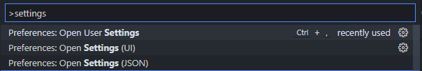

> 💡Note: you could also arrive there using the traditional menu bar using `File` → `Preferences` → `Settings` 

### Recommended Settings

- Set the default Python interpreter to your Miniconda installation
  
    For example

        C:\Users\uXXXXXX\AppData\Local\miniconda3\envs\base\python.exe

    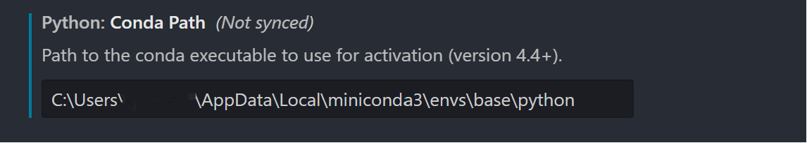


- Set Send to Interactive Window to ON
  
    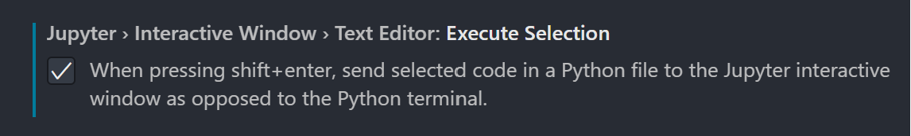

- Set Notebook Root Directory to `${workspaceRoot}`

    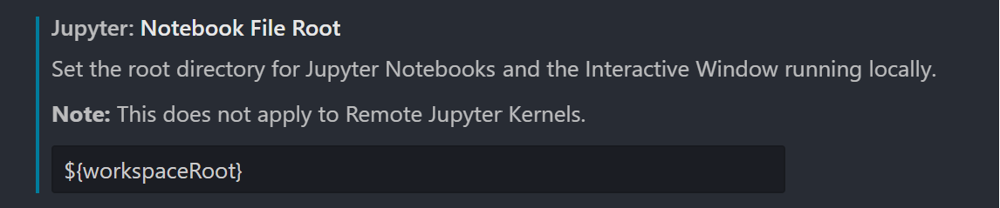

- Windows OS only: set default shell to Command Prompt (Optional. Powershell is ok)
    
    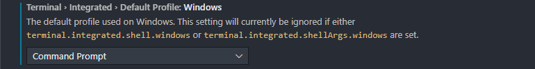

- Hide the annoying Minimap
    
    

- Turn on bracket autocompletion (life-changing)

    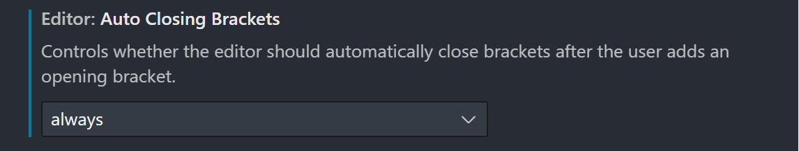

- Turn on word wrap
  
    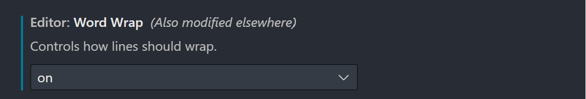
        

## Repositories
When working in VS Code, it is good practice to organize your projects into repositories.

A repository, or repo, is a collection of files associated with a project. Repositories can range from large research or data projects to something as simple as a folder containing a few Python scripts.

For this tutorial, we'll create a small test repository called:

        print hello

### 1. Create the repository folder 
Place it somewhere logical and easy to find.

For example, you might organize your projects like this:

        Desktop/
        └── repos/
            ├── vscode_setup_test/
            ├── project_1/
            └── project_2/

The exact location is up to you — the important thing is to develop a consistent organizational system.

### 2. Open the repository in VS Code

Open VS Code. If another repository opens by default, create a new window with the keys:

        Ctrl + Shift + N

Then open the `vscode_setup_test` folder as your workspace. You can drag and drop a folder from File Explorer.

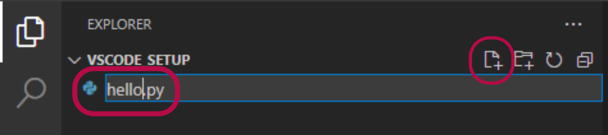

> 💡 Tip: In VS Code, a *workspace* generally corresponds to the project or repository you are currently working in.

## Python extension
Now let's create our first Python file.

### 1. Create a Python file

In the Explorer panel, create a new file and give it the `.py` extension:        

Opening the file should prompt VS Code to select a Python interpreter.

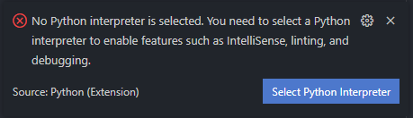

OR


> 💡 Tip: If the interpreter is not appearing, try saving your file, opening the terminal (`Ctrl + ` `), and clicking around in VS Code. Sometimes the interpreter lags. 


### 2. Select the Conda environment
If everything is configured correctly, VS Code should automatically find your Conda installation.

Select
        
        base

If VS Code cannot find it automatically, select:

        Enter interpreter path

and navigate to your Miniconda installation

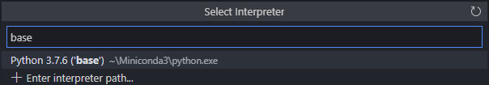
    

### 3. Check the active interpreter
Once selected, your active Python interpreter should appear in the lower-right corner of the VS Code window.

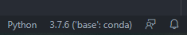

### 4. Open a terminal

Open a new terminal using:
        
        Ctrl + Shift + `

You can also use:

Terminal → New Terminal

If everything is working correctly, Conda should automatically activate and you should see:

        (base)

at the beginning of your terminal prompt.

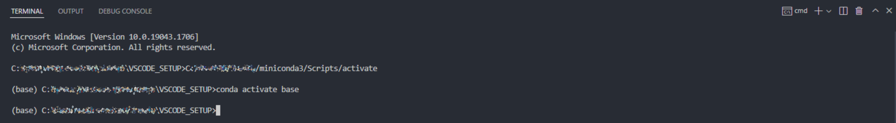
    
> 💡Tip: The `(base)` annotation indicates that the Conda `base` environment is currently active.


## Conda Environments
One of the major benefits of using Conda is that you can create separate environments for different projects.

This prevents packages and dependencies from one project from interfering with another.

### 1. Create an environment
Create a new environment with:
        
        conda create --name myenv python=3
    
Replace `myenv` with the name you want to give your environment.

You can also specify your exact python version, for example:

        conda create --name myenv python=3.11

> 💡Tip: Giving environments descriptive names can make it much easier to remember what they are used for.

### 2. Activate the environment

        conda activate myenv

The terminal prompt should now show:

        (myenv)

### 3. Install packages

Install the packages you'll need for your project.

For example:

        conda install seaborn pandas numpy scipy jupyter ipykernel

#### Important: Jupyter + IPyKernel

For this workflow, every new environment should contain:

        jupyter
        ipykernel

These packages allow VS Code's Python extension to communicate with the environment and run code through the Interactive Window.

> 💡 Think of the Conda environment as your project's toolbox. Each environment contains its own Python installation and the packages that project needs. 

### 4. Confirm the installation

During installation, Conda will calculate the packages and dependencies required.

It may display a long list of packages, even if you only requested a few. This is normal — Conda is resolving the dependencies needed to make everything work together.

When prompted:

        Proceed ([y]/n)?

enter:

        y

### 5. Reload VS Code

After creating the environment, reload VS Code.

Open the Command Palette:

        Ctrl + Shift + P

and select:

        Developer: Reload Window

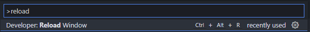

### 6. Select your new environment

After VS Code reloads, select the Python interpreter shown in the lower-right corner.

Choose the new Conda environment you just created.


You are now ready to run Python using your project-specific environment! :tada:

## Time to Test!

Let's make sure everything works.

Open the Python script we created earlier and add some simple code:

        message = "Hello, world!"
        print(message)

Select the lines of code and press:

        Shift + Enter

VS Code should open an Interactive Window and connect to the Python kernel associated with your selected Conda environment.

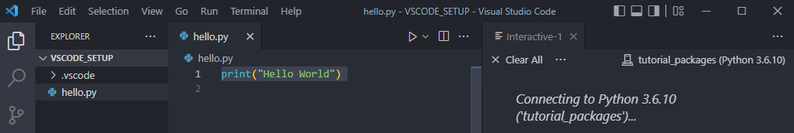

The selected code should then execute and display its output:

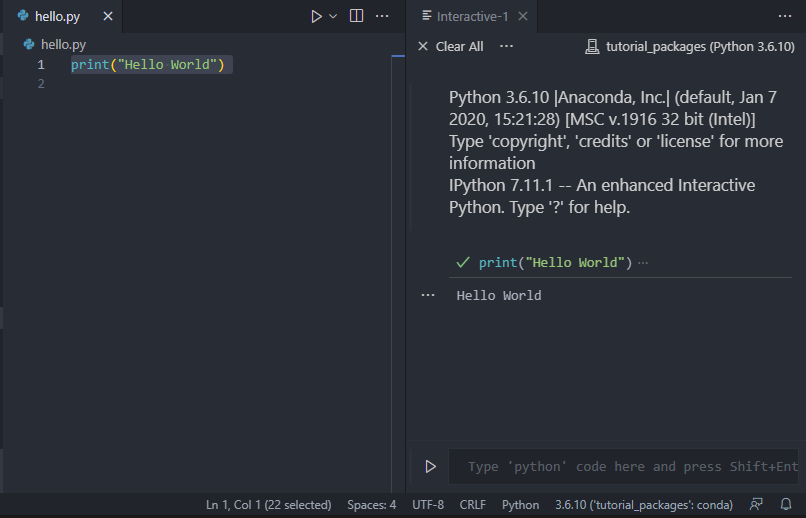

A green check mark next to the executed code indicates that it ran successfully.

Congratulations — you now have a working Python development environment in VS Code! :tada:

# 📚 Additional resources

- 🐍 You can learn more about using the Python Interactive Window here:
    
    [Working with Jupyter code cells in the Python Interactive window](https://code.visualstudio.com/docs/python/jupyter-support-py#_using-the-python-interactive-window)
    
- 🐍 Additional conda commands are available via a [cheat sheet](https://docs.conda.io/projects/conda/en/4.6.0/_downloads/52a95608c49671267e40c689e0bc00ca/conda-cheatsheet.pdf):
    
    [](https://docs.conda.io/projects/conda/en/4.6.0/_downloads/52a95608c49671267e40c689e0bc00ca/conda-cheatsheet.pdf)
    
- 🐍 Detailed instructions for managing python environments using conda are also available here:
    
    [Managing environments — conda 23.11.1.dev37 documentation](https://conda.io/projects/conda/en/latest/user-guide/tasks/manage-environments.html)
    
- 🐙 For more general info on using Git and GitHub for version control:
    
    [Learning to code: it's as easy and as complex as that.](https://dezeraecox.com/learning-to-code-spaghetti/)
    
- 🐙 And specifically for using Git and version control with VS Code:
    
    [Working with GitHub in Visual Studio Code](https://code.visualstudio.com/docs/editor/github)
    
- ✂️ To unlock a lot of the productivity in VS Code, snippets are indispensable. Check out the basics here:
    
    [Snippets in Visual Studio Code](https://code.visualstudio.com/docs/editor/userdefinedsnippets)


#  🎉 You're Ready to Code!

At this point you should have:

✅ VS Code installed

✅ Git installed

✅ A GitHub account

✅ Miniconda installed

✅ The Python and Jupyter VS Code extensions

✅ A working Conda environment

✅ A project repository

✅ Python running through the VS Code Interactive Window

From here, the next step is to start building projects — and, importantly, using Git to keep track of your work as you go.
